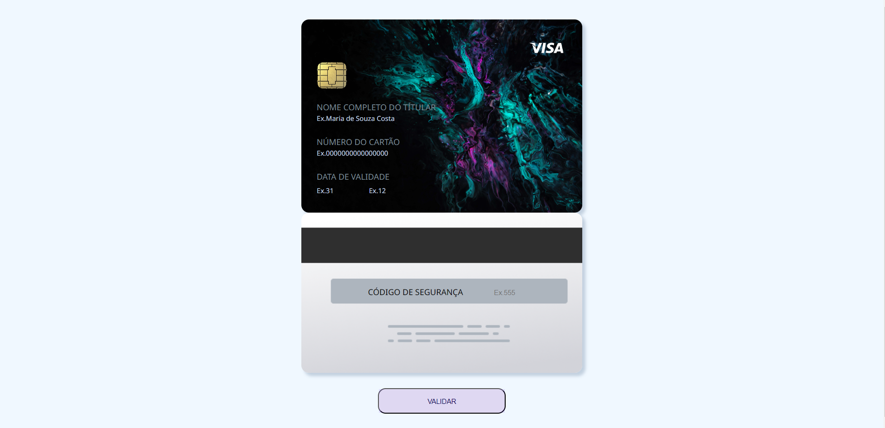
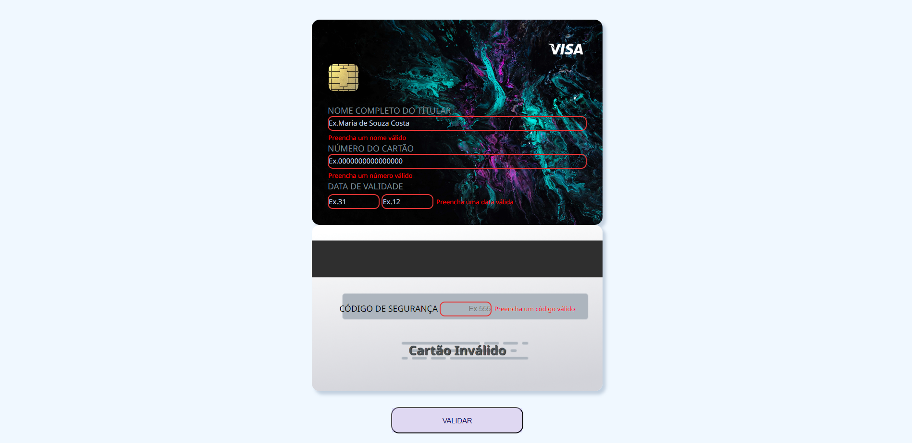

# Cartão de Crédito Válido

## Índice

- [1. Introdução](#1-Introdução)
- [2. Resumo do meu projeto](#2-resumo-do-meu-projeto)
- [3. Layout](#3-Layout)
- [4. Implementações Futuras](#4-Implementações-Futuras)

---

## 1. Introdução

O [algoritmo de Luhn](https://en.wikipedia.org/wiki/Luhn_algorithm), também
chamado de módulo 10, é um método de soma de verificação, usado para validar
números de identificação, como o IMEI de telefones celulares, cartões de crédito
etc.

Esse algoritmo é simples. Obtemos o inverso do número a ser verificado (que
contém apenas dígitos [0-9]); todos os números que ocupam uma posição par devem
ser multiplicados por dois; se esse número for maior ou igual a 10, devemos
adicionar os dígitos do resultado; o número a verificar será válido se a soma de
seus dígitos finais for um múltiplo de 10.

## 2. Resumo do meu projeto

Meu projeto foi pensado exclusivamente na experiência do usuário e quais recursos seriam utilizados para que o mesmo pudesse voltar sempre que quisesse. Para isso, foi desenvolvido um programa onde foi implementado uma série de recursos que permitem ao usuário fazer sua validação de cartão tendo a melhor experiência visual e funcional com uma interface intuitiva.

Alguns pontos a serem destacados são referentes às diversas funcionalidades para que o programa rode conforme o esperado, como por exemplo nos campos onde precisam de números não é posspermitido colocar letras e nem caracteres, assim como nos campos onde precisam de letras não é permitido o uso de número e nem caracteres especiais.

Além disso, foi implementado uma funcionalidade onde mostra em vermelho uma mensagem caso o usuário esqueça de preencher algum campo. No campo do número do cartão, há uma funcionalidade onde todos os números são mascarados, exceto os últimos 4, há também uma restrição de 16 números neste campo assim como uma restrição de apenas 3 números no campo código de segurança. Por fim, caso o número do cartão seja válido, uma mensagem será mostrada logo abaixo do campo código de segurança.

## 3. Layout

()
()

## 4. Implementações Futuras

- Mostrar bandeira do cartão
- Fazer uma pequena animação nos cartões
- Ajustar os espaços data e código de segurança
